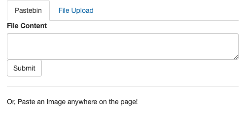

# IPFS Share
An example IPFS-powered Pastebin / Image Host / File Sharing application.

<p align="center">

</p>


## Instructions (Docker)

The easist way to start the application is using Docker compose.

```
git clone https://github.com/rameshvarun/ipfs-share.git
cd ipfs-share && docker compose up
```

You can now visit the application at `http://localhost:3000/`.

## Instructions (non-Docker)

To run outside of a Docker container, you need a few prequisites.
- A version of [Go](https://go.dev/doc/install)
- A running IPFS daemon.
    - The [IPFS Desktop app](https://docs.ipfs.tech/install/ipfs-desktop/) provides one while it is running.
    - Otherwise you can run `ipfs daemon` to run one from the CLI.

```
go get github.com/rameshvarun/ipfs-share
cd ~/go/src/github.com/rameshvarun/ipfs-share
go run server.go
```
